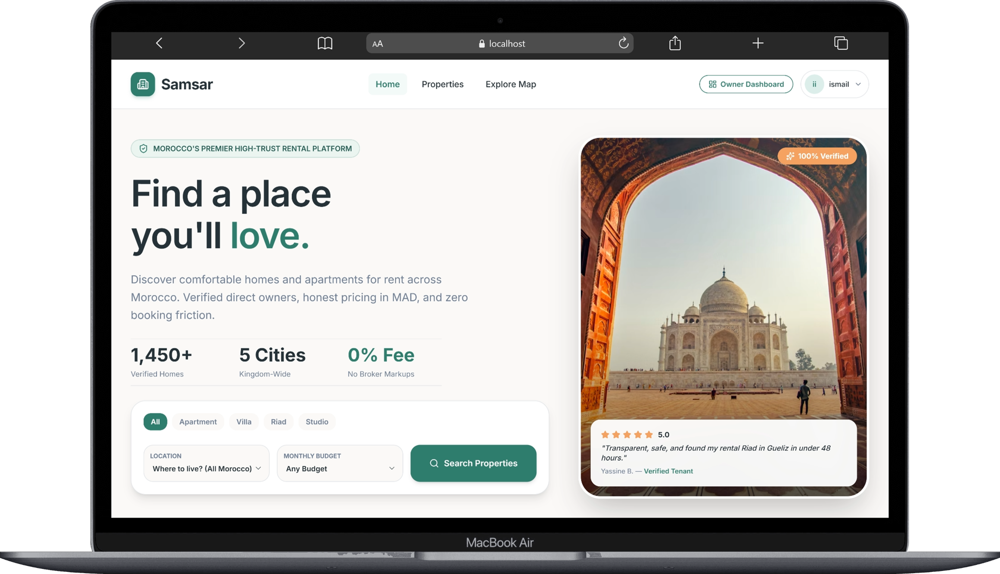
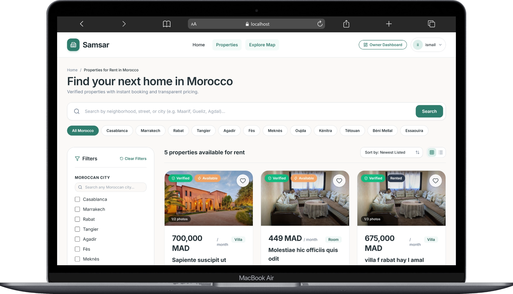
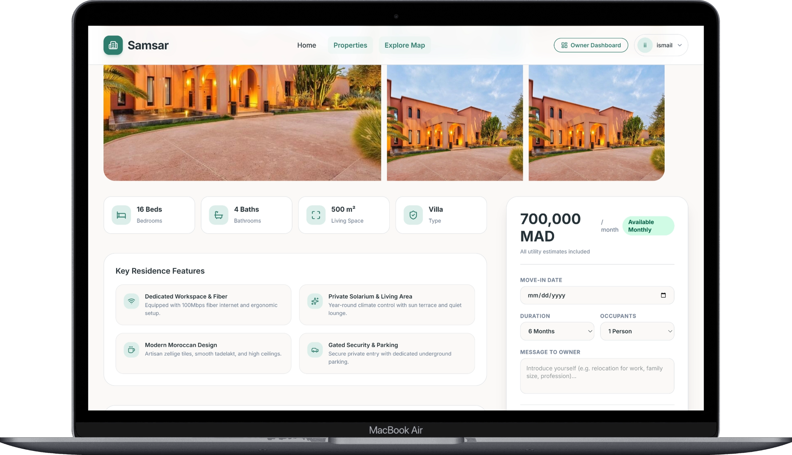
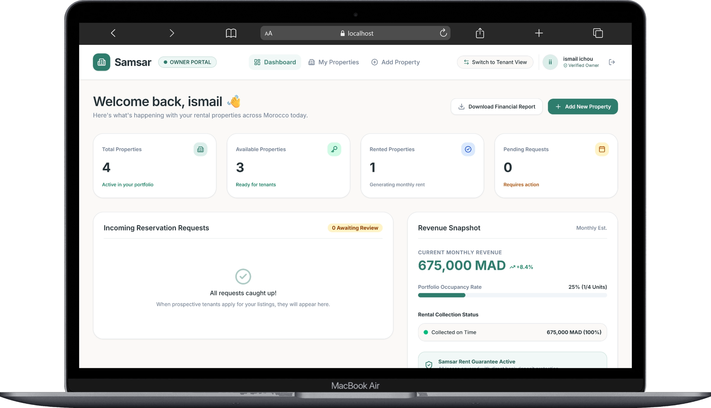

<div align="center">

# 🏠 Samsar

**Find your next home in Morocco.**

A full-stack MERN rental platform connecting renters with property owners — browse listings, save favorites, request reservations, and manage properties from a dedicated owner dashboard.

[](https://react.dev/)
[](https://redux-toolkit.js.org/)
[](https://vitejs.dev/)
[](https://tailwindcss.com/)
[](https://nodejs.org/)
[](https://www.mongodb.com/)
[](https://cloudinary.com/)
[](https://jwt.io/)

</div>

---

## 📖 About the Project

**Samsar** is a full-stack rental marketplace built with the **MERN stack** (MongoDB, Express, React, Node.js), tailored to the Moroccan real estate market. The platform serves two types of users:

- **Renters (`User` role)** — browse and filter properties, view detailed listings, save favorites, and send reservation requests to owners.
- **Property Owners (`Owner` role)** — publish listings with images, manage their property portfolio from a dashboard, and accept or reject incoming reservation requests.

The backend is a REST API built with Express 5 and MongoDB (via Mongoose), secured with JWT authentication stored in HttpOnly cookies. The frontend is a React 19 single-page application using Redux Toolkit for state management, React Router for navigation, and Tailwind CSS 4 for styling.

---

## ✨ Features

| Category                             | Description                                                                                                                            |
| ------------------------------------ | -------------------------------------------------------------------------------------------------------------------------------------- |
| 🔐 **Authentication**                | Register/login with email & password, JWT stored in an HttpOnly cookie, persistent session restore via `/api/auth/me`                  |
| 🧑‍🤝‍🧑 **Role-based access**             | Two roles — `User` (renter) and `Owner` — with route-level and API-level authorization                                                 |
| 🔎 **Property browsing & search**    | Public property listing with pagination                                                                                                |
| 🎛️ **Advanced filtering**            | Filter by city, property type, price range, bedrooms, bathrooms, surface range, and status; sort by newest, price ascending/descending |
| 🏡 **Property details**              | Full listing view including location, price, specs, images, and owner info                                                             |
| 🖼️ **Image handling**                | Upload up to 8 images per property to **Cloudinary**, either pre-uploaded or via direct multipart form submission                      |
| ❤️ **Favorites**                     | Renters can add, remove, check, and list their favorited properties                                                                    |
| 📅 **Reservations**                  | Renters can request a reservation with an optional message, view their reservations, and cancel a pending one                          |
| 🗂️ **Owner dashboard**               | Owners can view stats, manage their own listings (create, edit, delete), and review reservation requests per property                  |
| ✅ **Reservation lifecycle**         | Owners can accept or reject reservation requests; renters can cancel their own                                                         |
| 🧾 **Server-side validation**        | All inputs validated with `express-validator` before reaching business logic                                                           |
| 🌍 **Morocco-focused location data** | Built-in list of Moroccan cities/locations used for search and property creation                                                       |

---

## 🛠️ Tech Stack

### Frontend (`client/`)

| Technology                  | Purpose                                                               |
| --------------------------- | --------------------------------------------------------------------- |
| React 19                    | UI library                                                            |
| Vite 8                      | Build tool & dev server                                               |
| Redux Toolkit + React Redux | Global state management (auth, properties, favorites, reservations)   |
| React Router DOM 7          | Client-side routing & protected routes                                |
| Axios                       | HTTP client (configured with `withCredentials` for cookie-based auth) |
| Tailwind CSS 4              | Utility-first styling                                                 |
| React Hot Toast             | Toast notifications                                                   |
| Lucide React                | Icon set                                                              |

### Backend (`server/`)

| Technology           | Purpose                                           |
| -------------------- | ------------------------------------------------- |
| Node.js + Express 5  | REST API server                                   |
| MongoDB + Mongoose 8 | Database & ODM                                    |
| jsonwebtoken         | JWT issuing & verification                        |
| bcryptjs             | Password hashing                                  |
| cookie-parser        | Reading the HttpOnly auth cookie                  |
| express-validator    | Request validation                                |
| multer               | Handling multipart image uploads (memory storage) |
| cloudinary           | Cloud image hosting for property photos           |
| cors                 | Cross-origin requests with credentials            |
| dotenv               | Environment variable loading                      |
| nodemon (dev)        | Auto-restart during development                   |

---

## 📸 Screenshots

> Add your application screenshots here to give visitors a visual preview of Samsar.

Create a `screenshots/` folder at the root of the repository and reference the images below:

```
samsar/
└── screenshots/
    ├── home.png
    ├── property-listing.png
    ├── property-details.png
    ├── owner-dashboard.png
    └── reservations.png
```

| Home Page                       | Property Listing                                   |
| ------------------------------- | -------------------------------------------------- |
|  |  |

| Property Details                                   | Owner Dashboard                                     |
| -------------------------------------------------- | --------------------------------------------------- |
|  |  |

---

## 🏗️ Project Architecture

### Full repository tree

```
SAMSAR-/
├── client/                          # React frontend (Vite)
│   ├── public/                       # Static assets served as-is
│   │   ├── favicon.svg
│   │   └── icons.svg
│   ├── src/
│   │   ├── assets/                    # Bundled images (hero.png, react.svg, vite.svg)
│   │   ├── components/                 # Shared UI components
│   │   │   ├── FavoriteButton.jsx
│   │   │   ├── Footer.jsx
│   │   │   ├── LoadingScreen.jsx
│   │   │   ├── LocationSelect.jsx
│   │   │   ├── MobileBottomNav.jsx
│   │   │   ├── Navbar.jsx
│   │   │   ├── PropertyCard.jsx
│   │   │   ├── PropertyFilters.jsx
│   │   │   ├── PropertyImageUploader.jsx
│   │   │   ├── ProtectedRoute.jsx
│   │   │   └── PublicOnlyRoute.jsx
│   │   ├── constants/
│   │   │   └── moroccoLocations.js     # Morocco cities/regions dataset
│   │   ├── features/                   # Redux Toolkit slices + async thunks
│   │   │   ├── auth/
│   │   │   │   ├── authSlice.js
│   │   │   │   └── authThunks.js
│   │   │   ├── favorites/
│   │   │   │   ├── favoriteSlice.js
│   │   │   │   └── favoriteThunks.js
│   │   │   ├── properties/
│   │   │   │   ├── propertySlice.js
│   │   │   │   └── propertyThunks.js
│   │   │   └── reservations/
│   │   │       ├── reservationSlice.js
│   │   │       └── reservationThunks.js
│   │   ├── layouts/
│   │   │   ├── MainLayout.jsx          # Public/renter shell (Navbar + Footer)
│   │   │   └── OwnerLayout.jsx         # Owner dashboard shell
│   │   ├── pages/
│   │   │   ├── owner/                  # Owner-only pages
│   │   │   │   ├── CreateProperty.jsx
│   │   │   │   ├── EditProperty.jsx
│   │   │   │   ├── MyProperties.jsx
│   │   │   │   ├── OwnerDashboard.jsx
│   │   │   │   └── PropertyReservations.jsx
│   │   │   ├── Favorites.jsx
│   │   │   ├── Home.jsx
│   │   │   ├── Login.jsx
│   │   │   ├── MyReservations.jsx
│   │   │   ├── NotFound.jsx
│   │   │   ├── Properties.jsx
│   │   │   ├── PropertyDetails.jsx
│   │   │   └── Register.jsx
│   │   ├── services/
│   │   │   └── api.js                  # Shared Axios instance
│   │   ├── store/
│   │   │   └── store.js                # Redux store configuration
│   │   ├── App.css
│   │   ├── App.jsx                     # Route definitions
│   │   ├── index.css
│   │   └── main.jsx                    # App entry point
│   ├── .gitignore
│   ├── README.md                       # Default Vite template README
│   ├── eslint.config.js
│   ├── index.html
│   ├── package-lock.json
│   ├── package.json
│   └── vite.config.js
│
├── server/                          # Express backend (REST API)
│   ├── src/
│   │   ├── config/
│   │   │   ├── cloudinary.js            # Cloudinary SDK configuration
│   │   │   └── db.js                    # MongoDB/Mongoose connection
│   │   ├── controllers/                 # Route handlers
│   │   │   ├── auth.controller.js
│   │   │   ├── favorite.controller.js
│   │   │   ├── property.controller.js
│   │   │   └── reservation.controller.js
│   │   ├── middlewares/
│   │   │   ├── auth.middleware.js       # JWT verification
│   │   │   ├── error.middleware.js      # Centralized error handler
│   │   │   ├── notFound.middleware.js   # 404 handler
│   │   │   ├── role.middleware.js       # Role-based authorization
│   │   │   ├── upload.middleware.js     # Multer config for image uploads
│   │   │   └── validation.middleware.js # express-validator error collector
│   │   ├── models/                      # Mongoose schemas
│   │   │   ├── Favorite.js
│   │   │   ├── Property.js
│   │   │   ├── Reservation.js
│   │   │   └── User.js
│   │   ├── routes/                      # Express routers, mounted under /api/*
│   │   │   ├── auth.route.js
│   │   │   ├── favorite.routes.js
│   │   │   ├── property.route.js
│   │   │   └── reservation.route.js
│   │   ├── services/                    # Business logic layer
│   │   │   ├── auth.service.js
│   │   │   ├── favorite.service.js
│   │   │   ├── property.service.js
│   │   │   └── reservation.service.js
│   │   ├── uploads/
│   │   │   └── test.js
│   │   ├── utils/
│   │   │   └── generateToken.js         # JWT signing helper
│   │   ├── validations/                 # express-validator rule sets
│   │   │   ├── auth.validation.js
│   │   │   ├── favorite.validation.js
│   │   │   ├── property.validation.js
│   │   │   └── reservation.validation.js
│   │   ├── app.js                       # Express app setup (middleware & routes)
│   │   └── server.js                    # Entry point — connects DB & starts server
│   ├── .gitignore
│   ├── package-lock.json
│   └── package.json
│
├── .gitignore
└── README.md
```

---

## 🚀 Getting Started

### Prerequisites

- **Node.js** (v18+ recommended)
- **npm**
- A **MongoDB** database (local instance or a cloud cluster such as MongoDB Atlas)
- A **Cloudinary** account (for property image uploads)

### 1. Clone the repository

```bash
git clone https://github.com/walidnoussir/SAMSAR-.git
cd SAMSAR-
```

### 2. Install dependencies

**Backend:**

```bash
cd server
npm install
```

**Frontend:**

```bash
cd client
npm install
```

### 3. Configure environment variables

Create a `.env` file inside `server/` (see [Environment Variables](#-environment-variables) below for the full list and `.env.example` template).

The client does not require a `.env` file to run against the default local backend, since Axios falls back to a relative `/api` base URL proxied by Vite. Add a `client/.env` only if you need to point the frontend at a different API URL (see the `VITE_API_URL` variable).

### 4. Start the development servers

**Backend** (runs on `http://localhost:5000` by default):

```bash
cd server
npm run dev
```

**Frontend** (runs on Vite's default dev port, proxying `/api` to `http://localhost:5000`):

```bash
cd client
npm run dev
```

### 5. Build the frontend for production

```bash
cd client
npm run build
```

The production-ready static files are output to `client/dist`.

---

## 🔑 Environment Variables

All environment variables are consumed by the **backend** (`server/`). None of the values below are real credentials — replace them with your own.

| Variable                | Required                                 | Description                                                                                                                          |
| ----------------------- | ---------------------------------------- | ------------------------------------------------------------------------------------------------------------------------------------ |
| `PORT`                  | No (defaults to `5000`)                  | Port the Express server listens on                                                                                                   |
| `NODE_ENV`              | No                                       | `development` or `production` — controls cookie `secure`/`sameSite` behavior and whether stack traces are exposed in error responses |
| `MONGO_URI`             | ✅ Yes                                   | MongoDB connection string used by Mongoose                                                                                           |
| `JWT_SECRET`            | ✅ Yes                                   | Secret used to sign and verify JWT access tokens                                                                                     |
| `CLIENT_URL`            | No (defaults to `http://localhost:5173`) | Allowed origin for CORS, with credentials enabled                                                                                    |
| `CLOUDINARY_CLOUD_NAME` | ✅ Yes (for image uploads)               | Cloudinary account cloud name                                                                                                        |
| `CLOUDINARY_API_KEY`    | ✅ Yes (for image uploads)               | Cloudinary API key                                                                                                                   |
| `CLOUDINARY_API_SECRET` | ✅ Yes (for image uploads)               | Cloudinary API secret                                                                                                                |

The frontend (`client/`) only reads one optional variable, via Vite:

| Variable       | Required                | Description                                                                                                                    |
| -------------- | ----------------------- | ------------------------------------------------------------------------------------------------------------------------------ |
| `VITE_API_URL` | No (defaults to `/api`) | Overrides the API base URL used by Axios; only needed if the frontend and backend are not served through the same proxy/origin |

### `.env.example` (place in `server/.env`)

```env
# Server
PORT=5000
NODE_ENV=development

# Database
MONGO_URI=mongodb://localhost:27017/samsar

# Authentication
JWT_SECRET=replace_with_a_long_random_secret

# CORS
CLIENT_URL=http://localhost:5173

# Cloudinary (image uploads)
CLOUDINARY_CLOUD_NAME=your_cloud_name
CLOUDINARY_API_KEY=your_api_key
CLOUDINARY_API_SECRET=your_api_secret
```

---

## 🔄 Application Workflow

### Renter workflow

1. Register or log in (`User` role by default).
2. Browse properties on the **Properties** page, applying filters (city, type, price, bedrooms, bathrooms, surface, status) and sorting.
3. Open a property's **details** page to review full information and images.
4. Add/remove the property from **Favorites** for quick access later.
5. Submit a **reservation request** with an optional message to the owner.
6. Track reservation status (`pending`, `accepted`, `rejected`, `cancelled`) on the **My Reservations** page, and cancel a pending request if needed.

### Owner workflow

1. Register or log in with the `Owner` role.
2. From the **Owner Dashboard**, create a new property listing — including uploading up to 8 images to Cloudinary.
3. Manage listings under **My Properties**: edit details or delete a property.
4. Review reservation requests submitted for each property.
5. **Accept** or **reject** each reservation request.

### Frontend ↔ Backend communication

- The React app communicates with the Express API exclusively through a shared Axios instance (`client/src/services/api.js`), configured with `withCredentials: true` so the JWT HttpOnly cookie is sent automatically on every request.
- In development, Vite proxies requests from `/api` to `http://localhost:5000`, so no CORS configuration is needed locally.
- Redux Toolkit slices and async thunks (per feature: `auth`, `properties`, `favorites`, `reservations`) encapsulate all API calls and manage loading/error/data state for the UI.
- Route access is enforced client-side via `ProtectedRoute` (role-gated) and `PublicOnlyRoute` (redirects authenticated users away from login/register), and server-side via `authMiddleware` and `role.middleware`.

---

## 📡 API Documentation

Base URL: `/api`

All authenticated routes require the `accessToken` HttpOnly cookie (set automatically on login/register). Request/response body shapes are intentionally not documented in exhaustive detail beyond what's confirmed by the route/validation layer — inspect the corresponding controller/service for full response payloads.

### 🔐 Auth — `/api/auth`

| Method | Endpoint    | Auth        | Description                                                                                           |
| ------ | ----------- | ----------- | ----------------------------------------------------------------------------------------------------- |
| `POST` | `/register` | Public      | Register a new user (`firstName`, `lastName`, `email`, `password`, optional `phone`, optional `role`) |
| `POST` | `/login`    | Public      | Log in with `email` and `password`; sets the `accessToken` cookie                                     |
| `POST` | `/logout`   | Public      | Clears the `accessToken` cookie                                                                       |
| `GET`  | `/me`       | 🔒 Required | Returns the currently authenticated user's profile                                                    |

### 🏘️ Properties — `/api/properties`

| Method   | Endpoint  | Auth     | Description                                                                                                                                                                                                     |
| -------- | --------- | -------- | --------------------------------------------------------------------------------------------------------------------------------------------------------------------------------------------------------------- |
| `GET`    | `/`       | Public   | List properties with optional filters: `city`, `propertyType`, `minPrice`, `maxPrice`, `bedrooms`, `bathrooms`, `minSurface`, `maxSurface`, `status`, `sort` (`newest`/`priceAsc`/`priceDesc`), `page`, `limit` |
| `GET`    | `/my`     | 🔒 Owner | List properties owned by the authenticated owner                                                                                                                                                                |
| `GET`    | `/:id`    | Public   | Get a single property by ID                                                                                                                                                                                     |
| `POST`   | `/upload` | 🔒 Owner | Upload up to 8 images directly to Cloudinary and receive their URLs                                                                                                                                             |
| `POST`   | `/`       | 🔒 Owner | Create a new property (accepts JSON with pre-uploaded image URLs, or multipart form data with files)                                                                                                            |
| `PUT`    | `/:id`    | 🔒 Owner | Update a property owned by the authenticated owner                                                                                                                                                              |
| `DELETE` | `/:id`    | 🔒 Owner | Delete a property owned by the authenticated owner                                                                                                                                                              |

### ❤️ Favorites — `/api/favorites`

| Method   | Endpoint       | Auth    | Description                                                         |
| -------- | -------------- | ------- | ------------------------------------------------------------------- |
| `POST`   | `/`            | 🔒 User | Add a property (`propertyId`) to the authenticated user's favorites |
| `GET`    | `/`            | 🔒 User | List the authenticated user's favorited properties                  |
| `GET`    | `/:propertyId` | 🔒 User | Check whether a specific property is favorited                      |
| `DELETE` | `/:propertyId` | 🔒 User | Remove a property from favorites                                    |

### 📅 Reservations — `/api/reservations`

| Method  | Endpoint                | Auth     | Description                                                     |
| ------- | ----------------------- | -------- | --------------------------------------------------------------- |
| `POST`  | `/`                     | 🔒 User  | Create a reservation request (`propertyId`, optional `message`) |
| `GET`   | `/my`                   | 🔒 User  | List the authenticated user's own reservations                  |
| `PATCH` | `/:id/cancel`           | 🔒 User  | Cancel a pending reservation owned by the authenticated user    |
| `GET`   | `/property/:propertyId` | 🔒 Owner | List reservations submitted for a property the owner manages    |
| `PATCH` | `/:id/accept`           | 🔒 Owner | Accept a reservation request                                    |
| `PATCH` | `/:id/reject`           | 🔒 Owner | Reject a reservation request                                    |

---

## 🔒 Security

- **Authentication:** Stateless JWTs signed with `JWT_SECRET`, issued on register/login and stored in an **HttpOnly** cookie (`accessToken`) — not accessible to client-side JavaScript, mitigating XSS-based token theft.
- **Cookie hardening:** In production (`NODE_ENV=production`), cookies are set with `secure: true` and `sameSite: "none"`; in development they use `sameSite: "lax"`.
- **Password storage:** Passwords are hashed with `bcryptjs` before being persisted; the `password` field is excluded from queries by default (`select: false` in the User schema).
- **Authorization:** A dedicated `role.middleware` restricts endpoints to the appropriate role (`User` or `Owner`), and ownership checks in the service layer ensure owners can only modify/delete their own properties.
- **Input validation:** Every mutating endpoint runs through `express-validator` rule sets (`validations/`) before reaching controllers, rejecting malformed emails, invalid MongoDB IDs, out-of-range values, and missing required fields.
- **CORS:** Restricted to a single configurable origin (`CLIENT_URL`) with credentials enabled, rather than open to all origins.
- **Environment variable protection:** Secrets (`JWT_SECRET`, `MONGO_URI`, Cloudinary keys) are loaded via `dotenv` from a local `.env` file, which is excluded from version control via `.gitignore`.
- **Centralized error handling:** A dedicated error-handling middleware avoids leaking stack traces outside of development mode.

---

## 🧭 Future Improvements

> The following are potential enhancements **not currently implemented** in the codebase. They are listed as ideas for future development, not existing features.

- 📧 Email verification and password reset flows
- ⭐ Property reviews and ratings
- 💬 In-app messaging between renters and owners
- 🔔 Real-time notifications (e.g. via WebSockets) for reservation status changes
- 🗺️ Interactive map-based property search
- 💳 Online payment / deposit integration
- 🧪 Automated test suite (unit/integration/e2e)
- 📊 Extended owner analytics on the dashboard
- 🌐 Multi-language support (Arabic/French/English)

---

## 👤 Author & License

**Author:** Walid Noussir
GitHub: [@walidnoussir](https://github.com/walidnoussir)

**License:** No license file is currently present in this repository. All rights are reserved by the author unless a license is added.

---

<div align="center">

Made with ❤️ in Morocco

</div>
